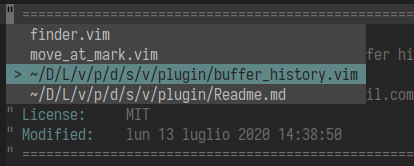
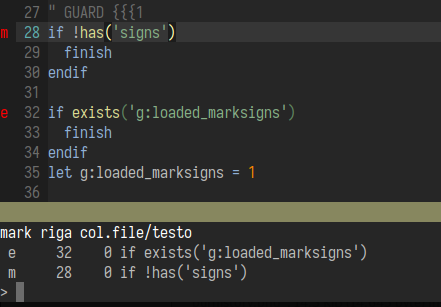
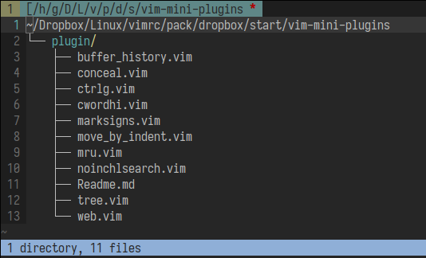
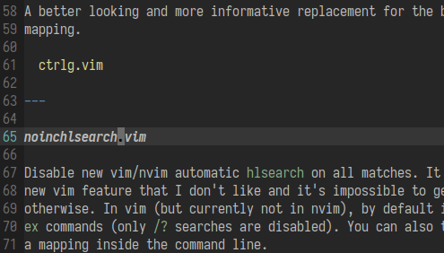
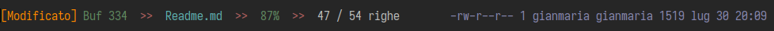

## vim-mini-plugins

This is a collection of small plugins that I made to take care of simple tasks.
Each of them resides in a single file, they're not `autoloaded` on purpose.
They're small and I don't want to create individual repos for them.

With the same mindset, the plugins have very little configuration options (or
none at all). A big plus for me.

Most of them has a documentation in vim `help` format. Consult them to know
default mappings and commands.

Read `:help mini-plugins` to have an overview and some basic instructions.

**Major caveat**: since I consider them as an extension to my default vimrc,
mappings are enabled by default, and reflect my personal preferences.
You can still disable them with a setting and use the plugs, if you don't like
them. Or you can modify the source and set them from there. I don't think these
plugins will need major updates.

Here follows only a short description of each of them and some pictures.

---

***buffer_history.vim***

Maintain a buffer history per window, based on the
[vim-buffer-history](https://github.com/dhruvasagar/vim-buffer-history) plugin
by Dhruva Sagar. It supports popup window feature in both vim and nvim.

  

---

***marksigns.vim***

An uncomplicated alternative to
[vim-signature](https://github.com/kshenoy/vim-signature). It only handles
lowercase and uppercase marks, but it's bug-free as far as I can see. It won't
mess with `viminfo/shada` files.

  

---

***tree.vim***

A wrapper for the `tree` executable that works as file browser that shows the
directories structure. I don't use it that much but it's cool to have
sometimes. Generally working on UNIX-like systems only.

  

---

***cwordhi.vim***

Underline the other occurrences of the word under cursor.

  

---

***ctrlg.vim***

A better looking and more informative replacement for the built-in `<C-G>`
mapping.

  

---

***noinchlsearch.vim***

Disable new vim/nvim automatic `hlsearch` on all matches. It is a relatively
new vim feature that I don't like and it's impossible to get the old behaviour
otherwise. In vim (but currently not in nvim), by default it still works for
`ex` commands (only `/?` searches are disabled). You can also toggle it with
a mapping inside the command line.

---

***mru.vim***

Browse recently accessed files with `fzf`. It is based on the
[mru](https://github.com/yegappan/mru) plugin by Yegappan Lakshmanan.

---

***conceal.vim***

Make invisible some pattern in the buffer.

---

***web.vim***

Commands to open urls and search/translate stuff on the web.

---

***move_by_indent.vim***

Mappings to move by indent level.
